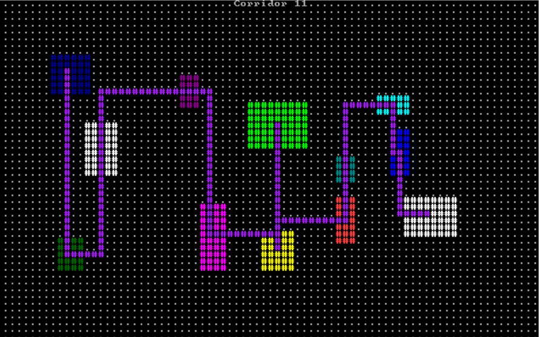
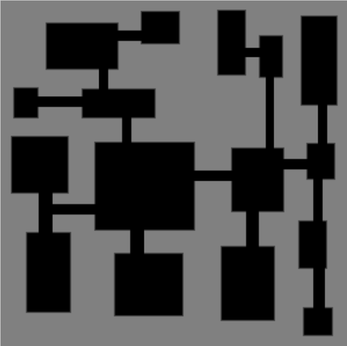
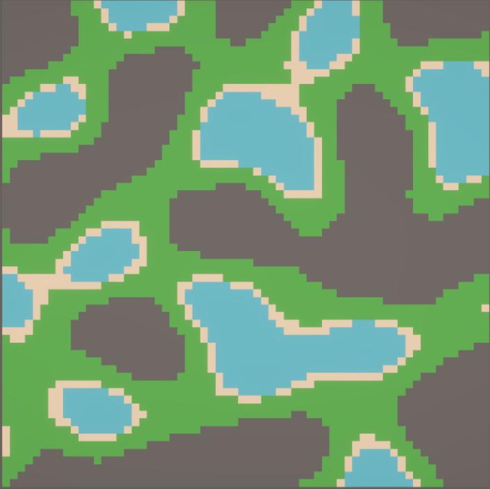

# Procedural Generation Toolbox

Une boîte à outils pour implémenter et tester différents algorithmes de génération procédurale dans Unity.

## Table des matières

- [Architecture générale](#architecture-générale)
- [Comment ajouter un nouvel algorithme](#comment-ajouter-un-nouvel-algorithme)
- [Algorithmes implémentés](#algorithmes-implémentés)
    - [Simple Room Placement](#simple-room-placement)
    - [Binary Space Partitioning (BSP)](#binary-space-partitioning-bsp)
    - [Cellular Automata](#cellular-automata)
    - [Noise Generator](#noise-generator)
- [Utilisation](#utilisation)
- [Dépendances](#dépendances)

## Architecture générale

L'architecture repose sur trois composants principaux :

### Grid et Cell

Le **Grid** c'est une structure de données 2D qui stocke des **Cell**. Chaque cellule peut contenir un **GridObject** qui est basé sur un template (genre "Grass", "Water", etc.).

Pour accéder à une cellule, on utilise `TryGetCellByCoordinates` qui retourne un bool si la cellule existe :

```csharp
// Accéder à une cellule
if (Grid.TryGetCellByCoordinates(x, z, out var cell))
{
    // Vérifier si la cellule contient un objet
    if (cell.ContainObject)
    {
        string tileName = cell.GridObject.Template.Name;
    }
}
```

C'est assez direct : on donne des coordonnées, on reçoit une cellule (ou pas).

### ProceduralGenerationMethod

C'est la classe abstraite de base pour tous les algos de génération. Elle donne accès à tout ce dont on a besoin :

- Le Grid via `GridGenerator.Grid`
- Le service de nombres aléatoires via `RandomService`
- Des méthodes helper pour placer des tuiles
- Des constantes pour les noms de tuiles (`GRASS_TILE_NAME`, `WATER_TILE_NAME`, etc.)

Voici à quoi ressemble la structure de base :

```csharp
public class MonAlgorithme : ProceduralGenerationMethod
{
    [SerializeField] private int _monParametre;
    
    protected override async UniTask ApplyGeneration(CancellationToken cancellationToken)
    {
        // Votre logique de génération ici
        
        // Vérifier l'annulation
        cancellationToken.ThrowIfCancellationRequested();
        
        // Ajouter un délai pour la visualisation
        await UniTask.Delay(GridGenerator.StepDelay, cancellationToken: cancellationToken);
    }
}
```

On hérite de cette classe, on override `ApplyGeneration`, et c'est parti !

### ProceduralGridGenerator

Composant Unity qui orchestre la génération.

Ce qu'il fait :

1. Génère la structure de base du Grid
2. Initialise la méthode de génération choisie avec une seed
3. Exécute l'algorithme de manière asynchrone
4. Affiche les informations de debug

Le générateur expose un éditeur custom permettant de :
- Visualiser les paramètres de la méthode de génération
- Lancer la génération en play mode
- Afficher le debug du Grid
- Nettoyer le Grid

## Comment ajouter un nouvel algorithme

C'est assez simple d'ajouter un nouvel algo. Voici les étapes :

### Etape 1 : Créer la classe

On crée un nouveau ScriptableObject qui hérite de `ProceduralGenerationMethod`. Voici un exemple complet :

```csharp
using System.Threading;
using Cysharp.Threading.Tasks;
using UnityEngine;

namespace Components.ProceduralGeneration
{
    [CreateAssetMenu(menuName = "Procedural Generation Method/Mon Algorithme")]
    public class MonAlgorithme : ProceduralGenerationMethod
    {
        [Header("Parametres specifiques")]
        [SerializeField] private int _monParametre = 10;
        
        protected override async UniTask ApplyGeneration(CancellationToken cancellationToken)
        {
            // Votre implémentation
            for (int step = 0; step < _maxSteps; step++)
            {
                cancellationToken.ThrowIfCancellationRequested();
                
                // Logique de génération
                GenererUnEtape();
                
                await UniTask.Delay(GridGenerator.StepDelay, cancellationToken: cancellationToken);
            }
        }
        
        private void GenererUnEtape()
        {
            for (int x = 0; x < Grid.Width; x++)
            {
                for (int z = 0; z < Grid.Lenght; z++)
                {
                    if (Grid.TryGetCellByCoordinates(x, z, out var cell))
                    {
                        // Déterminer le type de tuile
                        bool condition = RandomService.Range(0, 100) < _monParametre;
                        string tileName = condition ? GRASS_TILE_NAME : WATER_TILE_NAME;
                        
                        AddTileToCell(cell, tileName, true);
                    }
                }
            }
        }
    }
}
```

### Etape 2 : Créer l'asset ScriptableObject

1. Dans Unity, clic droit dans le Project > Create > Procedural Generation Method > Mon Algorithme
2. Nommer l'asset (ex : "MonAlgorithmeConfig")
3. Ajuster les paramètres dans l'Inspector

### Etape 3 : Utiliser l'algorithme

1. Sélectionner votre `ProceduralGridGenerator` dans la scène
2. Assigner votre ScriptableObject dans le champ "Generation Method"
3. Lancer le jeu et cliquer sur "Generate Grid" dans l'Inspector

### Méthodes utilitaires disponibles

```csharp
// Ajouter une tuile à une cellule
AddTileToCell(cell, GRASS_TILE_NAME, overrideExisting: true);

// Vérifier si une salle peut être placée
bool canPlace = CanPlaceRoom(new RectInt(x, y, width, height), spacing: 1);

// Générer un nombre aléatoire
int random = RandomService.Range(0, 100);
bool chance = RandomService.Chance(0.5f); // 50% de chance
```

## Algorithmes implémentés

### Simple Room Placement



L'approche la plus directe pour générer des donjons : on place des salles rectangulaires aléatoirement, et on les connecte avec des corridors en L.

L'algo essaie de placer des salles de tailles aléatoires à des positions aléatoires. Si une salle chevauche une autre, on l'ignore et on passe à la suivante. Une fois qu'on a placé toutes nos salles (ou atteint le nombre max de tentatives), on connecte les salles deux par deux dans l'ordre où elles ont été placées.

Pour les corridors, j'ai utilisé des corridors en forme de L : soit horizontal puis vertical, soit vertical puis horizontal (choisi aléatoirement). C'est pas le plus optimal mais ça marche bien pour un système simple.

**Paramètres :**
- Max Rooms : combien de salles on veut (on en aura peut-être moins si elles se chevauchent)
- Room Min/Max Size : les tailles min et max pour la largeur et hauteur
- Max Steps : nombre de tentatives de placement

Ce qui est bien avec cet algo, c'est que c'est rapide à implémenter et ça donne des résultats corrects. Par contre, les corridors peuvent se chevaucher (ce qui fait des trucs bizarres parfois), et y'a aucune garantie que toutes les salles soient vraiment connectées entre elles. Pour un prototype ça va, mais pour un jeu final faudrait probablement affiner.

### Binary Space Partitioning (BSP)



Le BSP c'est l'algo le plus complexe que j'ai implémenté. L'idée c'est de diviser récursivement l'espace en rectangles de plus en plus petits, jusqu'à ce qu'on puisse plus diviser. Dans chaque "feuille" de cet arbre binaire, on place une salle. Ensuite on connecte les salles sœurs.

Voici le processus :
1. On part d'un rectangle qui représente toute la grille
2. On essaie de le couper en deux (horizontalement ou verticalement selon une probabilité)
3. On vérifie que chaque moitié respecte bien les tailles minimales
4. On répète récursivement sur chaque moitié
5. Quand une zone est trop petite pour être divisée, on y place une salle
6. On connecte les salles sœurs avec des corridors

**Configuration :**
- Horizontal Split Chance : proba de couper horizontalement (0-1)
- Split Ratio : où on coupe (entre 0.3 et 0.7 pour éviter les divisions trop déséquilibrées)
- Max Split Attempt : combien de fois on essaie avant d'abandonner
- Leaf Min Size : taille mini d'une zone
- Room Min/Max Size : taille des salles dans les feuilles

**Pourquoi c'est bien :** On obtient une structure équilibrée et hiérarchique. Les salles sont bien distribuées dans l'espace, pas entassées dans un coin.

**Le problème :** C'est vraiment complexe à implémenter correctement. La récursion, la gestion de l'arbre binaire, la connexion des salles...

**Mon expérience perso :** J'ai galéré avec cet algo. La génération de salles marchait, mais pour les corridors j'ai dû demander de l'aide à une IA pour finir. La récursion et la gestion de l'arbre binaire, c'est des concepts que je maîtrise pas encore bien. Si je devais le recoder from scratch là, j'aurais encore du mal.

### Cellular Automata


Un algorithme de lissage assez élégant : on part d'un bruit aléatoire, et à chaque itération, on regarde les voisins de chaque cellule pour décider si elle devient sol ou eau. Au fil des itérations, le bruit se transforme en formes organiques naturelles.

Concrètement, voici comment ça fonctionne :
1. On génère une grille de départ avec un certain pourcentage de sol (par exemple 40%)
2. Pour chaque cellule, on compte combien de ses 8 voisins sont du sol
3. Si ce nombre dépasse le seuil (disons 4), la cellule devient sol, sinon elle devient eau
4. On répète ça plusieurs fois et les formes se stabilisent progressivement

J'ai trouvé que c'est parfait pour créer des îles ou des grottes avec des contours qui ont l'air naturels. Par contre, attention : on peut se retrouver avec plusieurs zones isolées les unes des autres. Dans ce cas, faut ajouter un post-traitement pour connecter les zones ou remplir les petits trous.

Les paramètres sont assez simples :
- Ground Density : le pourcentage initial de sol (0-100%)
- Min Ground Neighbour Count : le seuil pour devenir sol
- Max Steps : nombre d'itérations

Plus on fait d'itérations, plus les formes sont lisses. Mais après un certain point (genre 10-15 itérations), ça change plus vraiment.

### Noise Generator



Cet algorithme utilise des fonctions de bruit (Perlin, Simplex, Cellular) pour générer des terrains. L'avantage principal c'est d'obtenir des heightmaps continues qui donnent des biomes naturels - eau, plages, herbe, montagnes, etc.

Le principe est simple : on configure un générateur de bruit avec différents paramètres, on évalue chaque point de la grille pour obtenir une valeur, puis on convertit ces valeurs en types de tuiles selon des seuils. J'utilise FastNoiseLite qui propose plein de types de bruit différents.

Pour les fractales (FBm, Ridged, PingPong), elles ajoutent plusieurs couches de détail au terrain. C'est là que les paramètres comme les octaves et la lacunarité entrent en jeu. Plus d'octaves = plus de détail, mais attention à pas trop en mettre sinon ça devient du bruit visuel.

Les paramètres principaux à connaître :
- `Frequency` (0-1) : contrôle la "taille" des formes. Plus c'est bas, plus les formes sont grandes
- `Amplitude` (0-2) : l'intensité des variations de hauteur
- `Octaves` : nombre de couches de détail (je recommande 2-4)
- `Height Thresholds` : les seuils qui déterminent si c'est de l'eau, du sable, de l'herbe ou de la roche

C'est super utile pour créer des terrains naturels rapidement, mais c'est pas adapté si on veut des structures précises comme des salles ou des bâtiments. Aussi, faut expérimenter pas mal avec les paramètres avant de trouver quelque chose qui marche bien.

## Utilisation

### Configuration de base

1. Créer un GameObject avec le composant `ProceduralGridGenerator`
2. Configurer les paramètres du Grid (Width, Length, Cell Size)
3. Créer un ScriptableObject pour votre méthode de génération
4. Assigner la méthode au générateur
5. Configurer la seed et le délai entre les étapes

### Visualisation en temps réel

Le système utilise `UniTask` pour générer de manière asynchrone. Entre chaque étape, il y a un délai qui permet de voir la génération se faire pas à pas - c'est super pratique pour debugger.

On peut ajuster `Step Delay` (en millisecondes) pour contrôler la vitesse :
- 0 ms : génération instantanée (utile pour les tests rapides)
- 500 ms : vitesse confortable pour voir ce qui se passe
- 2000 ms : au ralenti, pratique quand on veut vraiment analyser chaque étape

### Seeds et reproductibilité

La seed c'est ce qui garantit qu'on aura toujours le même résultat avec la même config. Super pratique pour :
- Debugger : on peut reproduire exactement le même problème
- Partager des niveaux cool qu'on a trouvés
- Tester des modifs sans que le terrain change à chaque fois

```csharp
// Dans ProceduralGridGenerator
[SerializeField] private int _seed = 1234;

// Initialisation du RandomService
_generationMethod.Initialize(this, new RandomService(_seed));
```

Change juste la seed et tu auras un terrain complètement différent.

### Annulation de génération

Le système supporte l'annulation via `CancellationToken`. Si une nouvelle génération est lancée pendant qu'une autre est en cours, la précédente est automatiquement annulée.

## Dépendances

Ce projet utilise plusieurs systèmes personnalisés et bibliothèques externes :

- **VTools.Grid** : Système de grille 2D (Grid, Cell, GridObject)
- **VTools.RandomService** : Service de génération de nombres aléatoires avec seed
- **VTools.ScriptableObjectDatabase** : Système de gestion des templates d'objets
- **Cysharp.Threading.Tasks** : UniTask pour la programmation asynchrone
- **FastNoiseLite** : Bibliothèque de génération de bruit (Perlin, Simplex, etc.)

## Notes

Cette toolbox a été réalisée dans le cadre d'un module d'intro à la génération procédurale. C'est une base pour expérimenter avec différents algos et comprendre comment ils marchent.

L'architecture est faite pour être facilement extensible : on hérite de `ProceduralGenerationMethod`, on implémente sa logique, et boom, on bénéficie automatiquement de toute l'infra (Grid, Random, Debug, etc.). Pas besoin de réinventer la roue à chaque fois.

